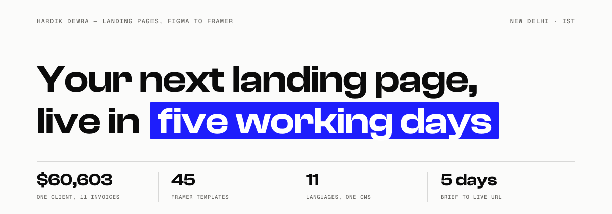
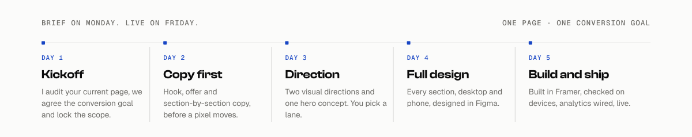

<a href="https://wedesignlandingpages.com">
  <picture>
    <source media="(prefers-color-scheme: dark)" srcset="assets/header-dark.svg">
    <source media="(prefers-color-scheme: light)" srcset="assets/header-light.svg">
    
  </picture>
</a>

I write the copy, design the page in Figma and build it in Framer.
One person does all three, so nothing gets lost in a handoff.

**[Book a 20-minute call](https://cal.com/hardikdewra)**

---

## What the last engagement actually did

Eight months as CRO and designer for Nuora, a DTC women's gut-health brand on Shopify, October 2025 to June 2026.

- **18% increase in add-to-cart rate** after moving the FAQ accordion below the buy button
- **25% fewer support tickets** about shipping and results, because the page answered both
- **$60,603 across 11 invoices**, every one paid, reconciled against both Contra and Deel

The first two are from [the case study](https://contra.com/p/Fo7vE6Wo-nuora-pdp-redesign-for-higher-conversion). The third is reconciled line by line in [a public audit of all 150 applications I sent](https://thehardikdewra.github.io/contra-application-audit/) that year, where this one client produced 98.1% of the money.

---

## Work you can open right now

Every link below is live. A [scheduled check](https://github.com/TheHardikDewra/TheHardikDewra/actions/workflows/link-check.yml) re-tests all 111 of them every Monday and opens an issue if any break, so this page cannot quietly rot.

| Project | What it is | Live |
|---|---|---|
| **We Design Landing Pages** | My studio site. Runs in 11 languages from one Framer CMS, with code components I wrote. | [Open](https://wedesignlandingpages.com) |
| **Global Acoustic Interior** | 12-page client site, copy through to build in Framer. Still live on their domain. | [Open](https://globalacousticinterior.com) |
| **Nuora PDP redesign** | Eight months of CRO and design for a DTC gut-health brand on Shopify. Case study, pages since retired. | [Open](https://contra.com/p/Fo7vE6Wo-nuora-pdp-redesign-for-higher-conversion) |
| **Annotated portfolio** | Real pages with numbered pins on the decisions doing the selling. | [Open](https://hardik-dewra.vercel.app) |
| **Structure Studies** | Luma, Arthur Brooks and Calendly rebuilt section for section, with original brand, copy and imagery. | [Open](https://landing-page-recreations.vercel.app) |
| **Landing Page Lab** | Twelve single-file landing pages, from a sleep drink to a roofer. | [Open](https://thehardikdewra.github.io/landing-page-lab/) |
| **PDR, six directions** | A studio site repaired, then redesigned five more ways, each with its own type and palette. | [Open](https://thehardikdewra.github.io/Tushar-Work/) |
| **WDLP Loop** | An agency page that ends by zooming into a browser frame showing its own first screen. | [Open](https://wdlp-loop.vercel.app) |

<b>Nuora, archived client work</b>

 

Eight months as CRO and designer for a DTC women's gut-health brand, October 2025 to June 2026. The engagement has ended and the storefront pages are retired, but these builds are still up.

| Project | What it is | Live |
|---|---|---|
| **Gut Biofilm Ritual page** | Direct-response product page, written and built end to end. | [Open](https://fabio-lovable-v1.vercel.app) |
| **Nuora landing page** | Static build from the Figma design. | [Open](https://new-landing-page-one-lime.vercel.app) |
| **Post-purchase upsell guide** | AfterSell setup handover for the team. | [Open](https://post-purchase-upsell-guide.vercel.app) |
| **SKU and subscription migration** | Operations handover covering the Skio migration. | [Open](https://thehardikdewra.github.io/nuora-sku-report-nadia/) |

### Framer templates, built end to end

| Template | What it is | Live |
|---|---|---|
| **Tessera** | 27 pages, five mega-menus, two CMS collections, a live permit-cost calculator. | [Open](https://convex-elements-248204.framer.app) |
| **Osprey** | Security SaaS, 9 pages. Headline built from two numbers the buyer already feels. | [Open](https://jazzed-channel-120285.framer.app) |
| **Orbit** | Analytics SaaS, 10 pages on one layout template with a CMS blog. | [Open](https://regular-hiring-471753.framer.app) |
| **Operator** | AI reception for dental practices, built in two directions. | [Open](https://adorable-concept-027840.framer.app) |
| **Harbor** | Client-ops SaaS with a scroll-pinned product tour. | [Open](https://streamlined-designer-041944.framer.app) |
| **Strength** | Gym and fitness template, sold on Lemon Squeezy. | [Open](https://strength.framer.website) |

---

## Hire me for a page

<a href="https://cal.com/hardikdewra">
  <picture>
    <source media="(prefers-color-scheme: dark)" srcset="assets/process-dark.svg">
    <source media="(prefers-color-scheme: light)" srcset="assets/process-light.svg">
    
  </picture>
</a>

| | Price | What you get |
|---|---|---|
| **Sprint** | $2,400 per page | Copy, design and build. Brief to live URL in five working days, two revision rounds, the Figma file, analytics wired. |
| **Partner** | $4,800 per month | A design partner on call for every launch. New pages, brand refreshes, decks. 48-hour turnaround, cancel any month. |
| **Audit** | $800 | A conversion audit of the page you already have, back inside 48 hours. |

Paid upfront. You deal with me from the first call to the live URL, with no account managers in between.

**[Book a 20-minute call](https://cal.com/hardikdewra)** and bring the page, the offer and your traffic numbers.

---

## Seven things I check before touching a design

This is the list I run on day one of every sprint. Take it and run it on your own page.

1. **Can a stranger say what you sell in five seconds?** If the headline needs the subhead to make sense, the headline is not doing its job yet.
2. **Does the headline carry a number or a named outcome?** "Write 40 ad variants in the time one draft used to take" beats "Write faster" every time.
3. **Is the first button visible on a phone without scrolling?** Most paid traffic lands on a 390px screen. Check it there first, not on your monitor.
4. **Does the button say what happens next?** "Book a 20-minute call" tells people the cost of clicking. "Get started" tells them nothing.
5. **Is the proof specific?** Full names, real companies, real numbers. A quote from "Sarah, CEO" does more harm than no quote at all.
6. **Are price, risk and time answered before the FAQ?** People leave at the first unanswered doubt. Put each answer next to the place the doubt shows up.
7. **Does it load fast on a slow phone?** A hero image that takes four seconds on mobile data loses people before they read a word.

---

## 45 Framer templates from one Figma kit

I rebuilt a 45-page Figma kit as 45 standalone Framer sites, each with its own brand name, copy and imagery, plus the tablet and phone layouts the kit never had. Every one is published and live.

<b>Open the full list of 45</b>

 

| Template | Niche | Live |
|---|---|---|
| **Aldridge** | Cloud SaaS | [Open](https://rejuvenated-location-648853.framer.app) |
| **Anchorage** | Web Hosting | [Open](https://incomplete-cause-317159.framer.app) |
| **Ashford** | Tax Software | [Open](https://jumpy-exercise-573216.framer.app) |
| **Ashgrove** | Finance Consultant Software | [Open](https://healthy-calls-325505.framer.app) |
| **Bellamy** | Social Media Marketing | [Open](https://healthy-ferret-348054.framer.app) |
| **Belmont** | Coworking Space | [Open](https://readable-something-329959.framer.app) |
| **Braxton** | It Software | [Open](https://jumpy-industry-591797.framer.app) |
| **Calder** | Finance App | [Open](https://knowledgeable-osprey-213785.framer.app) |
| **Cobham** | Project Management 2 | [Open](https://bright-cougar-043433.framer.app) |
| **Drayton** | Point Of Sales Pos 2 | [Open](https://quick-lettuce-695387.framer.app) |
| **Everly** | Life Insurance | [Open](https://shining-types-317050.framer.app) |
| **Fairwood** | Mortgage Agent | [Open](https://simplest-turtle-422759.framer.app) |
| **Fenwick** | AI Writing Tools | [Open](https://first-truly-319588.framer.app) |
| **Fernwood** | Email Marketing 2 | [Open](https://simplified-turtle-754154.framer.app) |
| **Halstead** | Digital Agency | [Open](https://optimistic-principles-289076.framer.app) |
| **Hatchwell** | Basic App Landing | [Open](https://sharp-absolute-279242.framer.app) |
| **Iona** | Personal Portfolio | [Open](https://plum-company-966303.framer.app) |
| **Ironwood** | Online Fitness Training | [Open](https://eternal-measure-059361.framer.app) |
| **Kestrel** | Email Marketing | [Open](https://charming-humans-114026.framer.app) |
| **Larkspur** | Podcast | [Open](https://gifted-otter-237827.framer.app) |
| **Linden** | Interior Service | [Open](https://exquisite-structure-807961.framer.app/) |
| **Lyceum** | Online Course Intro | [Open](https://rational-notes-595973.framer.app) |
| **Marlow** | Chat Application | [Open](https://kind-tenure-763552.framer.app) |
| **Marque** | Nft | [Open](https://intuitive-instance-439551.framer.app) |
| **Mason** | Website Builder | [Open](https://cute-chart-585895.framer.app) |
| **Merrow** | Fintech | [Open](https://diverse-forest-382400.framer.app) |
| **Northgate** | Regular Startup | [Open](https://harmonious-insurance-188884.framer.app) |
| **Ordnance** | Seo Agency | [Open](https://stormy-population-177861.framer.app) |
| **Pavilion** | Event Conference 2 | [Open](https://outstanding-button-611238.framer.app) |
| **Pennant** | CRM Software 2 | [Open](https://inspired-calls-179348.framer.app) |
| **Perch** | Support Desk | [Open](https://free-investment-789466.framer.app) |
| **Quorum** | Security SaaS | [Open](https://bisque-path-153328.framer.app) |
| **Rostrum** | Webinar | [Open](https://golden-branding-457623.framer.app) |
| **Rowan** | Event Conference | [Open](https://fluid-discussions-936143.framer.app) |
| **Selby** | Time Tracking | [Open](https://technical-porcupine-863117.framer.app) |
| **Sinclair** | Data Analysis | [Open](https://generic-startup-684790.framer.app) |
| **Thatcher** | CRM Software | [Open](https://funky-guardrails-627624.framer.app) |
| **Thornbury** | Cyber Security | [Open](https://youthful-number-992443.framer.app) |
| **Tillman** | Point Of Sales Pos | [Open](https://adored-combination-888671.framer.app) |
| **Tollgate** | Payment Gateway | [Open](https://obvious-exceptions-999908.framer.app) |
| **Trellis** | Project Management | [Open](https://true-hiring-082036.framer.app) |
| **Verity** | Design Studio | [Open](https://beautiful-empathy-853021.framer.app) |
| **Wardell** | Vpn Software | [Open](https://strategic-conference-001209.framer.app) |
| **Wexford** | Digital Marketing Agency | [Open](https://yummy-steps-554045.framer.app) |
| **Whitfield** | Course | [Open](https://sensible-intuition-945914.framer.app) |

---

## Things I built to think with

Side projects, tools and studies. Most started as a question I could not answer by reading.

| Project | What it is | Live |
|---|---|---|
| **Sri Yantra, solved exactly** | The nine-triangle figure solved so every concurrency condition holds to 1e-61, with a 3D Maha Meru and free SVG, PNG, GLB and STL. | [Open](https://sriyantra.vercel.app) |
| **Conversion Lab** | Paste a landing page URL, get a scored CRO teardown with ranked findings and stronger copy. | [Open](https://conversion-lab-five.vercel.app) |
| **Contra application audit** | 150 applications reconciled against the money that actually landed. Three replies. One paid $60,603. | [Open](https://thehardikdewra.github.io/contra-application-audit/) |
| **Write like Dakota Robertson** | 285 newsletter emails turned into rules, moves and a draft checker. | [Open](https://dakota-robertson.vercel.app) |
| **Write like Om Swami** | A writing curriculum reverse-engineered from 1.19M words of books and blog posts. | [Open](https://os-writing.vercel.app) |
| **How to write like this** | A craft study of one prose style. 23 named techniques, each with a drill. | [Open](https://om-swami-prose-study.vercel.app) |
| **Todoist clone** | A faithful local-first rebuild in React and TypeScript. No login, tasks stay in your browser. | [Open](https://todoist-web.vercel.app) |
| **Instagram Maxxing** | Archive a profile and rebuild it in Figma as a swipe file, plus a metrics CSV that normalises engagement across years of follower growth. | [Open](https://instagram-maxxing.vercel.app) |
| **One Account Left** | Consolidating two GitHub accounts into one, and the hook that stops the mistake recurring. | [Open](https://github-identity-guard.vercel.app) |
| **Apple Silicon comparison** | Every chip from M1 to M5 across Base, Pro and Max tiers. | [Open](https://apple-silicon-comparison.vercel.app) |
| **Cayley digraph visualiser** | Interactive 3D Hamiltonian cycle decomposition on Z_m^3. | [Open](https://cayley-graph-viz.vercel.app) |
| **Buddha's 5 Gates of Speech** | A framework for mindful speaking, from the Abhaya Sutta. | [Open](https://speech-framework.vercel.app) |

<b>More builds and experiments</b>

 

| Project | What it is | Live |
|---|---|---|
| **Portfolio, dark index** | The first iteration of my portfolio. | [Open](https://hardikdewra.vercel.app) |
| **WDLP Directions** | Six design directions for my own agency site, plus faithful rebuilds of two competitor sites from a 77-page scrape. | [Open](https://wdlp-directions.vercel.app) |
| **Notes Consolidation** | Obsidian and Apple Notes merged into NotePlan. Interactive migration map and the scripts that did it. | [Open](https://notes-consolidation.vercel.app) |
| **Claude Work Dashboard** | A dashboard over my own work sessions. | [Open](https://claude-work-dashboard.vercel.app) |
| **/create-template build plan** | The plan for a skill that rebuilds any landing page in Framer at three breakpoints. | [Open](https://thehardikdewra.github.io/create-template-plan/) |
| **Five Lives of a Bronze** | FLORA Museum Challenge entry, built from the Met's Chola Standing Parvati. | [Open](https://thehardikdewra.github.io/flora-museum-challenge-2026-09-08/) |
| **Dr. Maya Iyer** | An author and sleep-science site with one consistent generated face in every shot. Structure study of arthurbrooks.com. | [Open](https://landing-page-recreations.vercel.app/maya-iyer) |
| **AI Agents Meetings** | Landing page for an AI meeting-agent product, Figma to Framer. | [Open](https://ai-meetings.framer.website) |
| **Sasam AI** | B2B landing page for a landscaping services company. | [Open](https://sasam-ai-v0.framer.website) |
| **Contra Expert Badges** | Step-by-step playbooks for four Contra expert badges. | [Open](https://thehardikdewra.github.io/Contra-Expert-Badges/) |
| **FLORA Expert Badge** | Interactive checklist, pitch editor and eight workflow briefs. | [Open](https://thehardikdewra.github.io/FLORA-Expert-Badge/) |
| **IPL win predictor** | Real-time match probability. | [Open](https://ipl-project-ecru.vercel.app) |
| **GreenPath AI** | Neo-brutalist landing page for a shopping assistant. | [Open](https://greenpath-ai-six.vercel.app) |
| **trio Digital** | Neo-brutalist marketing site, Swiss-inspired system. | [Open](https://trio-digital-neo-brutalist-design.vercel.app) |
| **Freewrite for Web** | A distraction-free writing surface in the browser. | [Open](https://freewrite-windows.vercel.app) |
| **45-minute warrior** | A visual workout plan. | [Open](https://visual-workout-plan.vercel.app) |
| **Lottie Files badge** | A motion-first badge page. | [Open](https://lottie-files-badge.vercel.app) |

---

## Sanskrit texts, engineered

Devanagari and IAST set properly, spaced-repetition practice, offline-capable, no accounts. These started as my own practice and turned into the hardest typesetting and data work I do.

| Text | What it is | Live |
|---|---|---|
| **Lalita Sahasranama** | 1000 names with meanings, verses, practice tools and commentary. | [Open](https://lalita-sahasranama.com) |
| **Vishnu Sahasranama** | 1000 names with spaced-repetition practice and cross-device sync. | [Open](https://vishnu-sahasranama-stotram.com) |
| **Sri Rudram** | 22 anuvakas with Sanskrit, meanings and synchronised chanting audio. | [Open](https://shri-rudram.com) |
| **Durga Saptashati** | 700 verses, 13 chapters, 3 charitas, full paath with all angas. | [Open](https://durga-saptashati.vercel.app) |
| **Lalita Trishati** | 300 names, structured on the fifteen-syllabled mantra. | [Open](https://lalita-trishati.com) |
| **Shodashi Ashtottara** | 108 names from the Brahmayamala Tantra. | [Open](https://shodashi-ashtottara.com) |
| **Sri Vidya notes** | The daily krama, fifteen nyasas, the puja vidhi and nine avaranas on an interactive Sri Chakra. | [Open](https://panchadashi.vercel.app) |
| **Sri Sukta, 53 mantras** | A 53-mantra sadhana planner, 40 days of japa per name. | [Open](https://sri-sukta-53-mantra.vercel.app) |
| **Gayatri purushcharana** | Japa counter, vow keeper and a 36-step vidhi. | [Open](https://gayatri-japa.vercel.app) |
| **Mantra counter** | A digital japa mala on a ring of 108. Installable, works offline. | [Open](https://mantra-counter-eight.vercel.app) |

<b>Three more, built for another practitioner</b>

 

I built these; the text and the practice material are authored by Aahan, not me.

| Project | What it is | Live |
|---|---|---|
| **Sri Lalita Sadhana** | Daily sadhana companion: practice tracker, text library, anusthana tracker, planner, journal and a panchanga calendar. | [Open](https://sri-lalita-sadhana.vercel.app) |
| **Sacred Living Companion** | Daily nitya sadhana, focused swadhyaya and a 69-text collection. | [Open](https://lalita-sadhana-companion.vercel.app) |
| **Sacred Path of Maa Lalita** | 69 texts arranged in six progressive stages. | [Open](https://lalita-sadhana-path.vercel.app) |

---

## Elsewhere

| | |
|---|---|
| **Studio** | [wedesignlandingpages.com](https://wedesignlandingpages.com) |
| **Book a call** | [cal.com/hardikdewra](https://cal.com/hardikdewra) |
| **Contra** | [contra.com/hardikdewra](https://contra.com/hardikdewra), identity verified, expert badges for Framer, Replo, Lummi, Kajabi and MagicPath |
| **Framer** | [framer.com/@hardikdewra](https://www.framer.com/@hardikdewra/), listed as a Framer Expert |
| **LinkedIn** | [in/hardikdewra](https://www.linkedin.com/in/hardikdewra/), 14,528 followers |
| **Medium** | [hardikdewra.medium.com](https://hardikdewra.medium.com/), 17 articles on UX and design psychology |
| **X** | [@TheHardikDewra](https://x.com/TheHardikDewra) |

 

**Send me the page that isn't converting.**

I work from New Delhi on IST, which puts me online from late afternoon for US teams.
English and Hindi, plus professional working Spanish.

**[Book a 20-minute call](https://cal.com/hardikdewra)**

